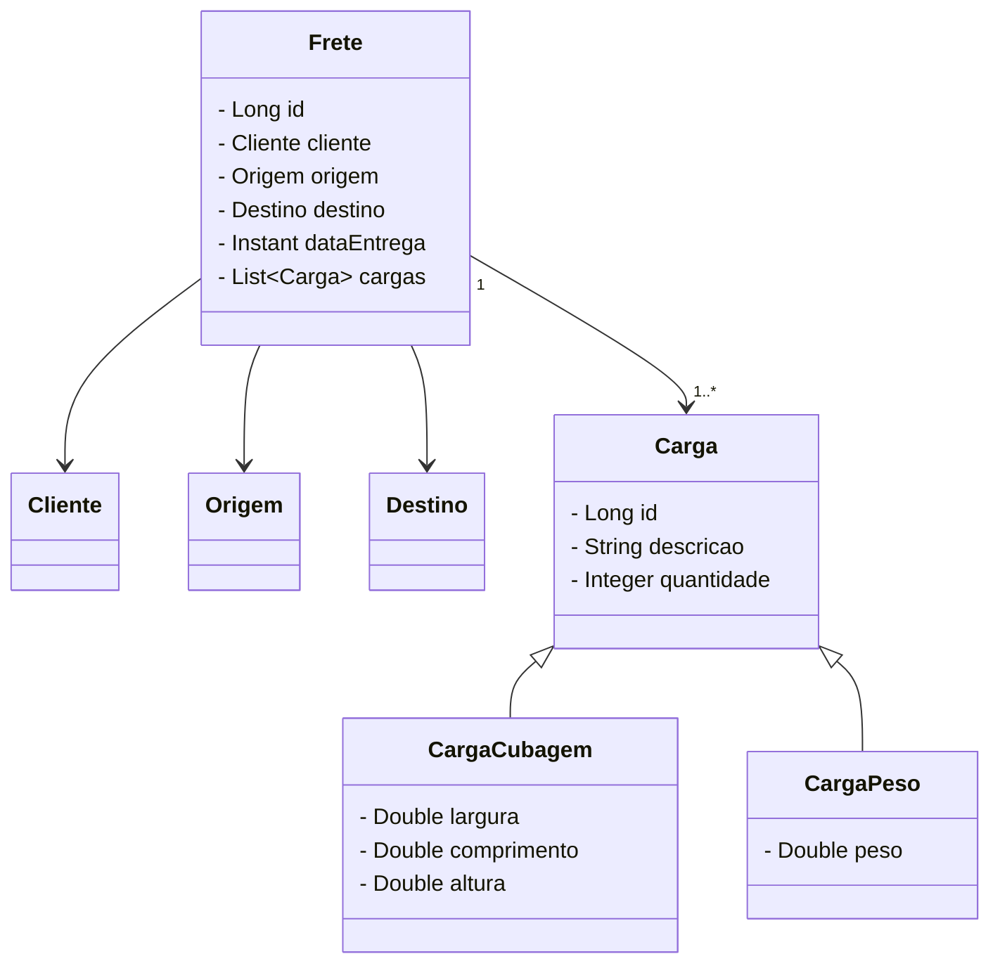

# Cadastro de fretes

Projeto de cadastro para gestão de fretes, feito para um desafio de uma vaga de emprego para a Mazzatech (cliente AZShip).

## Enunciado do desafio

Cada cliente tem seu conjunto de propriedades que precisa ser armazenado. Por exemplo, para alguns
clientes é importante armazenar Cubagem do frete mas não é importante armazenar o Peso.

A aplicação deve disponibilizar uma API REST ou GraphQL com as seguintes operações:.

* Cadastrar Frete
* Buscar Frete (a busca deve receber apenas um parâmetro que deve ser utilizado para buscar em todas as propriedades do frete, e deve ser paginada)
* Atualizar dados do Frete
* Remover Frete

# Modelagem (sujeito a alterações, como qualquer projeto hehehe)
## As classes iniciais que imaginei são as seguintes: 

## Considerações

Como não havia muitas informações sobre regra de negócio (não conheço muito sobre fretes), busquei algumas coisas na internet e no chatGPT.

## Requisitos
* Como os fretes pertencem a um cliente (transportadora, ou sei lá o que), para um frete ser cadastrado o id daquele cliente deve estar cadastrado
* Cada cliente possui um tipo de carga, como se fosse um contrato (por Cubagem, por Peso).
  Se o cliente for um contrato por Cubagem, só vai salvar as dimensões de largura, altura e comprimento (em metros). Do contrário, salvará apenas o Peso (em kg)

# Tecnologias utilizadas

* Java 17
* Spring Boot 3.2.4
* Spring Data JPA (ORM - Mapeamento de objeto relacional, parte de banco de dados)
* Spring web
* Banco de dados H2 (persistência de dados em memória para testes)
* PostgreSQL - SGBD mais robusto para persistência de dados da aplicação
* Docker
* Swagger (ainda está faltando)
* Flyway - Para versionamento do banco de dados.
  Como um histórico das alterações feitas no banco de dados do sistema, através de migrations. (não está ainda, será providenciado) 

# Melhorias futuras mapeadas

* Implementar algum tipo de cálculo, de acordo com a carga e distância
* Integração com api google maps, para obter distância em quilômetros entre origem e destino.
* Definir um preço padrão de frete e o adicionar as variações pela distância.
* Deploy em alguma plataforma de nuvem (Render - grátis, ou AWS - não grátis)
    

